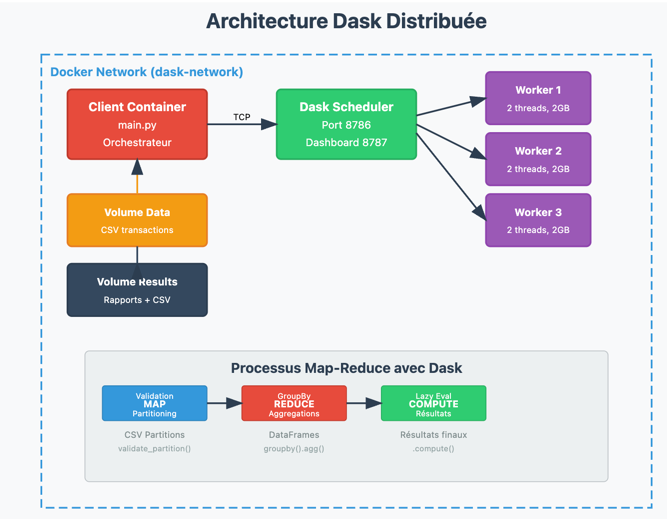

### Composants:
- **1 Scheduler Dask** : Coordonne les tâches
- **3 Workers Dask** : Exécutent les calculs en parallèle
- **1 Client** : Lance l'analyse
- **Dashboard Web** : (http://localhost:8787)

## Installation et Démarrage

### 1. Démarrage du cluster

```bash
docker-compose up -d
```

Attendre un peu (10-15 secondes) que le cluster soit complètement démarré.

### 5. Lancement de l'analyse

Le client se lance automatiquement avec le cluster. Pour relancer l'analyse :

```bash
docker-compose run --rm client
```

### 6. Consultation des résultats

- **Dashboard Dask** : http://localhost:8787
- **Rapport d'analyse** : `results/analysis_report.txt`
- **Logs du client** : `make client-logs`


